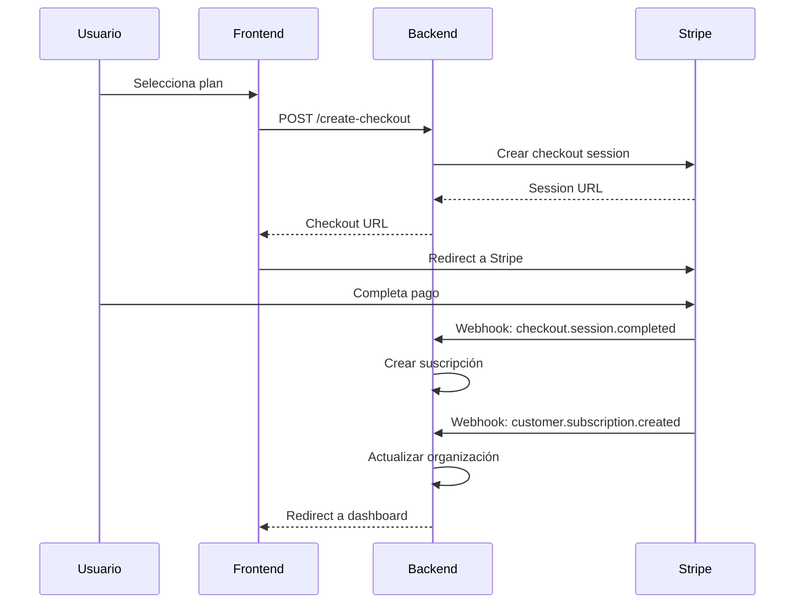
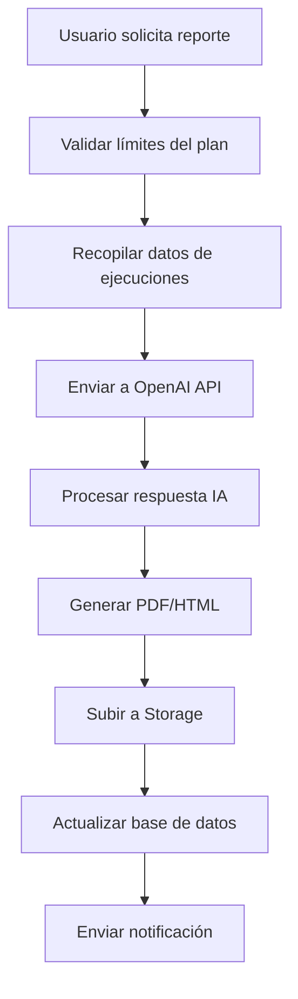

# 🏗️ CAS Platform - Arquitectura Completa

## 📋 Resumen Ejecutivo

La plataforma CAS (Cybersecurity as a Service) es una solución SaaS multi-tenant escalable que automatiza servicios de ciberseguridad incluyendo protección perimetral, escaneo de vulnerabilidades, pruebas de rendimiento y generación de reportes con IA.

## 🏛️ Arquitectura General

### Stack Tecnológico

```
┌─────────────────────────────────────────────────────────────┐
│                    FRONTEND LAYER                            │
│  React 18 + TypeScript + Tailwind CSS + Vite               │
│  - Dashboard multi-tenant                                   │
│  - Gestión de servicios                                     │
│  - Reportes interactivos                                    │
│  - Billing y suscripciones                                  │
└─────────────────────────────────────────────────────────────┘
                              │
                              ▼
┌─────────────────────────────────────────────────────────────┐
│                    BACKEND LAYER                             │
│  Supabase (PostgreSQL + Edge Functions + Auth + Storage)   │
│  - Row Level Security (RLS)                                │
│  - Real-time subscriptions                                 │
│  - Serverless functions                                     │
│  - File storage                                             │
└─────────────────────────────────────────────────────────────┘
                              │
                              ▼
┌─────────────────────────────────────────────────────────────┐
│                  EXTERNAL SERVICES                           │
│  • Cloudflare API (Protección perimetral)                  │
│  • Shodan API (Escaneo de vulnerabilidades)                │
│  • Stripe API (Pagos y suscripciones)                      │
│  • OpenAI API (Generación de reportes)                     │
│  • Email Service (Notificaciones)                          │
│  • Cypress Cloud (Pruebas de seguridad)                    │
└─────────────────────────────────────────────────────────────┘
```

### Modelo Multi-Tenant

```
Organization (Tenant)
├── Users (Roles: admin, manager, analyst, viewer)
├── Domains (Assets monitored)
├── Subscriptions (Plan + Billing)
├── Service Executions (Security scans)
├── Reports (AI-generated)
├── Usage Records (Billing tracking)
└── Notifications (Alerts)
```

## 🗄️ Base de Datos - Modelo Entidad-Relación

### Tablas Principales

#### 1. **Organizations** (Tenants)
```sql
- id (UUID, PK)
- name (VARCHAR)
- slug (VARCHAR, UNIQUE)
- plan_id (UUID, FK)
- subscription_status (ENUM)
- stripe_customer_id (VARCHAR)
- settings (JSONB)
```

#### 2. **User Profiles**
```sql
- id (UUID, PK, FK to auth.users)
- organization_id (UUID, FK)
- role (ENUM: admin, manager, analyst, viewer)
- permissions (JSONB array)
- status (ENUM: active, inactive, invited)
```

#### 3. **Plans**
```sql
- id (UUID, PK)
- name, slug (VARCHAR)
- price_monthly, price_yearly (DECIMAL)
- max_domains, max_scans_per_month (INTEGER)
- features, enabled_services (JSONB arrays)
- stripe_price_id_monthly, stripe_price_id_yearly (VARCHAR)
```

#### 4. **Subscriptions**
```sql
- id (UUID, PK)
- organization_id (UUID, FK)
- plan_id (UUID, FK)
- stripe_subscription_id (VARCHAR)
- status (ENUM: active, past_due, canceled, trialing)
- billing_cycle (ENUM: monthly, yearly)
- current_period_start, current_period_end (TIMESTAMP)
```

#### 5. **Domains** (Assets)
```sql
- id (UUID, PK)
- organization_id (UUID, FK)
- domain, subdomain (VARCHAR)
- monitoring_enabled (BOOLEAN)
- scan_frequency_hours (INTEGER)
- status (ENUM: active, inactive, error)
- dns_records, ssl_info (JSONB)
```

#### 6. **Security Services**
```sql
- id (UUID, PK)
- name, slug (VARCHAR)
- service_type (ENUM: perimeter, vulnerability, performance, security_test)
- default_config (JSONB)
- required_plan_features (JSONB array)
```

#### 7. **Service Executions**
```sql
- id (UUID, PK)
- organization_id (UUID, FK)
- domain_id (UUID, FK)
- service_id (UUID, FK)
- status (ENUM: pending, running, completed, failed, cancelled)
- config, results (JSONB)
- execution_time_seconds (INTEGER)
- triggered_by (ENUM: scheduled, manual, api)
```

#### 8. **Reports**
```sql
- id (UUID, PK)
- organization_id (UUID, FK)
- domain_id (UUID, FK)
- report_type (ENUM: security, performance, vulnerability, comprehensive)
- status (ENUM: generating, completed, failed)
- generated_by_ai (BOOLEAN)
- summary (TEXT)
- findings, recommendations (JSONB arrays)
- file_url (TEXT)
```

#### 9. **Usage Records** (Billing)
```sql
- id (UUID, PK)
- organization_id (UUID, FK)
- resource_type (ENUM: scan, report, api_call, storage)
- quantity (INTEGER)
- billing_period_start, billing_period_end (TIMESTAMP)
```

#### 10. **Invoices**
```sql
- id (UUID, PK)
- organization_id (UUID, FK)
- stripe_invoice_id (VARCHAR)
- amount_due, amount_paid (DECIMAL)
- status (ENUM: draft, open, paid, void)
- period_start, period_end (TIMESTAMP)
```

### Row Level Security (RLS)

```sql
-- Ejemplo de política RLS
CREATE POLICY "Users can only access own organization data" 
ON domains FOR ALL USING (
  organization_id IN (
    SELECT organization_id FROM user_profiles 
    WHERE id = auth.uid()
  )
);
```

## 🔌 Backend - Edge Functions

### 1. **Authentication Middleware**
```typescript
// /functions/auth-middleware/
- withAuth(): Validación JWT + permisos
- withPlanLimits(): Control de límites por plan
- Role-based access control
```

### 2. **Organization Management**
```typescript
// /functions/organization-management/
GET  /profile     - Perfil de organización
GET  /members     - Miembros del equipo
POST /invite      - Invitar usuarios
PUT  /update      - Actualizar organización
```

### 3. **Security Services**
```typescript
// /functions/security-services/
GET  /list        - Servicios disponibles
POST /execute     - Ejecutar servicio
GET  /executions  - Historial de ejecuciones
PUT  /cancel      - Cancelar ejecución
```

### 4. **Subscription Management**
```typescript
// /functions/subscription-management/
GET  /plans              - Planes disponibles
POST /create-checkout    - Crear sesión de pago
POST /webhook           - Webhooks de Stripe
PUT  /change-plan       - Cambiar plan
```

### 5. **AI Reports**
```typescript
// /functions/ai-reports/
POST /generate    - Generar reporte con IA
GET  /list        - Listar reportes
GET  /download    - Descargar reporte
```

### 6. **Notification System**
```typescript
// /functions/notifications/
GET  /list        - Notificaciones del usuario
POST /send        - Enviar notificación
PUT  /mark-read   - Marcar como leída
```

## 🎨 Frontend - Estructura React

### Arquitectura de Componentes

```
src/
├── components/
│   ├── Dashboard/
│   │   ├── DashboardLayout.tsx      # Layout principal
│   │   ├── DashboardHome.tsx        # Dashboard home
│   │   └── Sidebar.tsx              # Navegación lateral
│   ├── Domains/
│   │   ├── DomainsList.tsx          # Lista de dominios
│   │   ├── DomainForm.tsx           # Formulario de dominio
│   │   └── DomainDetails.tsx        # Detalles de dominio
│   ├── Services/
│   │   ├── ServicesList.tsx         # Servicios disponibles
│   │   ├── ExecutionHistory.tsx     # Historial de ejecuciones
│   │   └── ServiceConfig.tsx        # Configuración de servicio
│   ├── Reports/
│   │   ├── ReportsList.tsx          # Lista de reportes
│   │   ├── ReportViewer.tsx         # Visualizador de reportes
│   │   └── ReportGenerator.tsx      # Generador de reportes
│   ├── Billing/
│   │   ├── PlanSelector.tsx         # Selector de planes
│   │   ├── PaymentForm.tsx          # Formulario de pago
│   │   ├── InvoiceHistory.tsx       # Historial de facturas
│   │   └── UsageStats.tsx           # Estadísticas de uso
│   └── Team/
│       ├── TeamMembers.tsx          # Miembros del equipo
│       ├── InviteForm.tsx           # Invitar miembros
│       └── RoleManager.tsx          # Gestión de roles
├── contexts/
│   ├── AuthContext.tsx              # Contexto de autenticación
│   └── AppContext.tsx               # Contexto de aplicación
├── hooks/
│   ├── useAuth.ts                   # Hook de autenticación
│   ├── useApi.ts                    # Hook para API calls
│   └── useSubscription.ts           # Hook de suscripción
├── types/
│   └── cas.ts                       # Tipos TypeScript
└── utils/
    ├── api.ts                       # Cliente API
    ├── auth.ts                      # Utilidades de auth
    └── billing.ts                   # Utilidades de billing
```

### Contextos React

#### AuthContext
```typescript
interface AuthContextType {
  user: UserProfile | null
  organization: Organization | null
  subscription: Subscription | null
  signIn: (email: string, password: string) => Promise<void>
  signOut: () => Promise<void>
  updateProfile: (data: Partial<UserProfile>) => Promise<void>
}
```

#### AppContext
```typescript
interface AppContextType {
  domains: Domain[]
  services: SecurityService[]
  executions: ServiceExecution[]
  reports: Report[]
  stats: DashboardStats | null
  refreshData: () => Promise<void>
}
```

## 💳 Sistema de Pagos y Suscripciones

### Flujo de Suscripción



### Planes y Límites

| Plan | Precio/mes | Dominios | Scans/mes | Características |
|------|------------|----------|-----------|-----------------|
| **Free** | $0 | 1 | 5 | Escaneo básico, reportes mensuales |
| **Basic** | $29 | 5 | 50 | Escaneo avanzado, reportes semanales, alertas |
| **Pro** | $99 | 25 | 200 | Suite completa, reportes diarios, API, IA |
| **Enterprise** | $299 | 100 | 1000 | White-label, soporte dedicado, SLA |

### Control de Límites

```typescript
// Middleware de validación de límites
async function withPlanLimits(
  context: AuthContext,
  resourceType: 'scan' | 'domain' | 'report',
  quantity: number = 1
): Promise<{ allowed: boolean; error?: Response }> {
  // Verificar uso actual vs límites del plan
  const currentUsage = await getCurrentUsage(context.organization.id, resourceType)
  const planLimit = context.subscription?.plan?.limits[resourceType]
  
  return {
    allowed: currentUsage + quantity <= planLimit,
    error: currentUsage + quantity > planLimit 
      ? new Response('Plan limit exceeded', { status: 429 })
      : undefined
  }
}
```

## 🔐 Control de Acceso y Consumo

### Roles y Permisos

```typescript
enum Role {
  ADMIN = 'admin',           // Acceso completo
  MANAGER = 'manager',       // Gestión de equipo y servicios
  ANALYST = 'analyst',       // Ejecutar scans y ver reportes
  VIEWER = 'viewer'          // Solo lectura
}

const PERMISSIONS = {
  'manage_organization': ['admin'],
  'manage_team': ['admin', 'manager'],
  'manage_billing': ['admin'],
  'execute_scans': ['admin', 'manager', 'analyst'],
  'view_reports': ['admin', 'manager', 'analyst', 'viewer'],
  'generate_reports': ['admin', 'manager', 'analyst']
}
```

### Rate Limiting

```typescript
// Rate limiting por organización
const rateLimits = {
  'api_calls': { window: '1h', limit: 1000 },
  'scans': { window: '1d', limit: 50 },
  'reports': { window: '1d', limit: 10 }
}
```

## 📊 Sistema de Reportes con IA

### Flujo de Generación



### Tipos de Reportes

1. **Security Report**: Análisis de vulnerabilidades y protecciones
2. **Performance Report**: Métricas de rendimiento y optimización
3. **Vulnerability Report**: Escaneo detallado de vulnerabilidades
4. **Comprehensive Report**: Análisis completo multi-servicio

### Prompt Engineering

```typescript
const buildReportPrompt = (data: ReportData, type: string) => `
Genera un reporte de ${type} para el dominio: ${data.domain}

Datos de escaneos recientes:
${data.executions.map(exec => `
- ${exec.service.name}: ${exec.status}
- Resultados: ${JSON.stringify(exec.results)}
`).join('\n')}

Proporciona respuesta JSON con:
{
  "summary": "Resumen ejecutivo (max 300 palabras)",
  "findings": [
    {
      "title": "Título del hallazgo",
      "severity": "critical|high|medium|low",
      "description": "Descripción detallada",
      "impact": "Impacto potencial"
    }
  ],
  "recommendations": [
    {
      "title": "Recomendación",
      "priority": "high|medium|low",
      "description": "Descripción detallada",
      "implementation": "Cómo implementar"
    }
  ]
}
`
```

## 🔒 Seguridad y Escalabilidad

### Medidas de Seguridad

#### 1. **Autenticación y Autorización**
- JWT tokens con Supabase Auth
- Row Level Security (RLS) en PostgreSQL
- Role-based access control (RBAC)
- Multi-factor authentication (MFA)

#### 2. **Protección de APIs**
- Rate limiting por organización
- Validación de entrada robusta
- CORS configurado correctamente
- API keys encriptadas

#### 3. **Protección de Datos**
- Encriptación en tránsito (HTTPS)
- Encriptación en reposo (PostgreSQL)
- Backup automático de datos
- Auditoría de acceso

#### 4. **Compliance**
- GDPR compliance
- SOC 2 Type II (objetivo)
- Logs de auditoría completos
- Retención de datos configurable

### Escalabilidad

#### 1. **Base de Datos**
```sql
-- Particionamiento por organización
CREATE TABLE service_executions_org_1 
PARTITION OF service_executions 
FOR VALUES IN ('org-uuid-1');

-- Índices optimizados
CREATE INDEX CONCURRENTLY idx_executions_org_created 
ON service_executions (organization_id, created_at DESC);
```

#### 2. **Caching**
- Redis para sesiones y cache
- CDN para assets estáticos
- Query caching en Supabase

#### 3. **Monitoreo**
- Métricas de performance (APM)
- Alertas de sistema
- Health checks automatizados
- Logging estructurado

#### 4. **Deployment**
- CI/CD con GitHub Actions
- Blue-green deployments
- Auto-scaling de Edge Functions
- Multi-region deployment

## 📦 Entregables de Implementación

### 1. **Base de Datos**
- ✅ Schema completo con 12 tablas principales
- ✅ RLS policies para multi-tenancy
- ✅ Índices optimizados para performance
- ✅ Triggers y funciones PL/pgSQL

### 2. **Backend APIs**
- ✅ 6 Edge Functions principales
- ✅ Middleware de autenticación
- ✅ Integración con Stripe
- ✅ Sistema de webhooks

### 3. **Frontend**
- ✅ Componentes React modulares
- ✅ Contextos para estado global
- ✅ Tipos TypeScript completos
- ✅ Hooks personalizados

### 4. **Integraciones**
- ✅ Cloudflare API (protección perimetral)
- ✅ Stripe API (pagos y suscripciones)
- ✅ OpenAI API (generación de reportes)
- 🔄 Shodan API (escaneo de vulnerabilidades)
- 🔄 Cypress Cloud (pruebas de seguridad)

### 5. **Documentación**
- ✅ Arquitectura completa
- ✅ API Reference
- ✅ Guías de deployment
- ✅ Documentación de usuario

## 🚀 Roadmap de Implementación

### Fase 1: MVP (4-6 semanas)
- [x] Base de datos y autenticación
- [x] Dashboard básico
- [x] Gestión de dominios
- [x] Integración con Cloudflare
- [x] Sistema de suscripciones básico

### Fase 2: Core Features (6-8 semanas)
- [ ] Servicios de seguridad completos
- [ ] Sistema de reportes con IA
- [ ] Gestión de equipo
- [ ] Notificaciones en tiempo real
- [ ] API pública

### Fase 3: Advanced Features (8-10 semanas)
- [ ] Integraciones avanzadas (Shodan, Cypress)
- [ ] White-label para Enterprise
- [ ] Analytics avanzados
- [ ] Mobile app
- [ ] Compliance (SOC 2)

### Fase 4: Scale & Optimize (Ongoing)
- [ ] Multi-region deployment
- [ ] Advanced caching
- [ ] Performance optimization
- [ ] Enterprise features

## 💡 Recomendaciones Técnicas

### 1. **Desarrollo**
- Usar TypeScript estricto en todo el proyecto
- Implementar testing automatizado (Jest + Cypress)
- Code review obligatorio para todos los PRs
- Documentación inline en código crítico

### 2. **Deployment**
- Staging environment que replique producción
- Feature flags para rollouts graduales
- Monitoring y alertas desde día 1
- Backup y disaster recovery plan

### 3. **Performance**
- Lazy loading de componentes React
- Optimización de queries SQL
- Compresión de assets
- CDN para contenido estático

### 4. **Seguridad**
- Penetration testing regular
- Dependency scanning automatizado
- Secrets management (no hardcoded keys)
- Regular security audits

Esta arquitectura proporciona una base sólida y escalable para una plataforma CAS de nivel empresarial, con capacidad para manejar miles de organizaciones y millones de ejecuciones de servicios de seguridad.