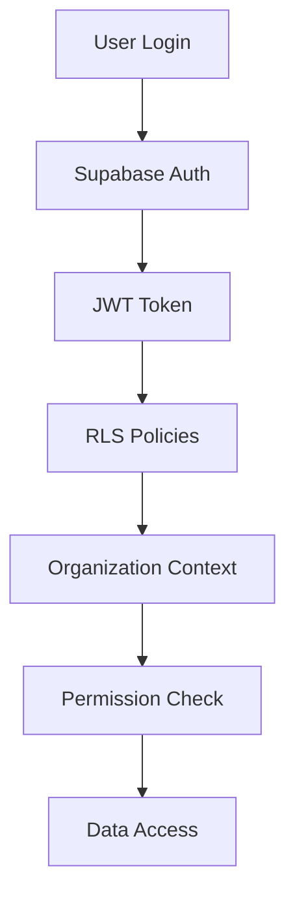

# 🔐 HARDCORE SECURITY ARCHITECTURE
## Cuban CAS Platform - Enterprise Multi-Tenant Security

> **Capítulo de Tesis**: Arquitectura de Seguridad Multi-Tenant para Plataformas CaaS

---

## 🎯 FILOSOFÍA DE SEGURIDAD

### Principios Fundamentales
1. **Zero Trust Architecture**: Nunca confiar, siempre verificar
2. **Defense in Depth**: Múltiples capas de seguridad
3. **Least Privilege**: Acceso mínimo necesario
4. **Audit Everything**: Trazabilidad completa de acciones

### Modelo Multi-Tenant
```
🏢 Organization (Tenant)
├── 👥 Users (Multiple roles)
├── 💳 Subscription (Single active)
├── 🌐 Domains (Multiple assets)
├── 🔍 Services (Security tools)
├── 📊 Reports (AI-generated)
└── 📋 Audit Trail (Complete history)
```

---

## 🗄️ ARQUITECTURA DE BASE DE DATOS

### 1. Core Multi-Tenant Structure

#### **Organizations** (Tenant Root)
```sql
organizations
├── id (UUID, PK)
├── name, slug, domain
├── plan (free|basic|pro|enterprise)
├── status (active|suspended|trial|canceled)
├── stripe_customer_id (Billing)
├── security_config (JSONB)
└── audit fields
```

**Características Clave:**
- ✅ Tenant isolation por UUID
- ✅ Configuración de seguridad personalizable
- ✅ Estados de cuenta granulares
- ✅ Integración Stripe nativa

#### **Organization Members** (Access Control Matrix)
```sql
organization_members
├── organization_id → organizations(id)
├── user_id → auth.users(id)
├── role (admin|manager|analyst|viewer)
├── permissions (JSONB array)
├── status (active|inactive|invited)
└── invitation tracking
```

**Roles y Permisos:**
- **Admin**: Control total de la organización
- **Manager**: Gestión de usuarios y servicios
- **Analyst**: Ejecución de scans y reportes
- **Viewer**: Solo lectura

### 2. Security Services Architecture

#### **Security Services** (Service Catalog)
```sql
security_services
├── name, slug, description
├── service_type (perimeter|vulnerability|performance|security|compliance)
├── default_config (JSONB)
├── required_permissions (JSONB)
├── cost_per_execution
└── execution_time_limit
```

**Servicios Implementados:**
- 🛡️ **Perimeter Protection**: Cloudflare WAF/DDoS
- 🔍 **Vulnerability Scan**: Shodan + custom tools
- ⚡ **Performance Test**: Load testing
- 🔒 **Security Test**: OWASP Top 10
- 📋 **Compliance Scan**: PCI/GDPR compliance

#### **Service Executions** (Execution History)
```sql
service_executions
├── organization_id (Tenant isolation)
├── domain_id (Target asset)
├── service_id (Service type)
├── status (pending|running|completed|failed|canceled)
├── config, results (JSONB)
├── timing fields
├── triggered_by (manual|schedule|api|retry)
└── audit trail
```

### 3. AI Reports & Analytics

#### **Reports** (AI-Generated Intelligence)
```sql
reports
├── organization_id (Tenant isolation)
├── domain_id (Target asset)
├── report_type (security|vulnerability|performance|compliance|comprehensive)
├── format (pdf|html|json)
├── summary, findings, recommendations (JSONB)
├── generated_by_ai (boolean)
├── file_url, file_size
└── generation metadata
```

**Características AI:**
- ✅ Generación automática con OpenAI GPT-4
- ✅ Análisis contextual de vulnerabilidades
- ✅ Recomendaciones priorizadas por riesgo
- ✅ Múltiples formatos de salida

### 4. Billing & Usage Tracking

#### **Subscriptions** (Billing Management)
```sql
subscriptions
├── organization_id (Tenant)
├── plan_id → plans(id)
├── status (active|canceled|past_due|unpaid|trialing)
├── billing_cycle (monthly|yearly)
├── stripe_subscription_id
├── current_period_start/end
└── trial_end, canceled_at
```

#### **Usage Records** (Consumption Tracking)
```sql
usage_records
├── organization_id (Tenant)
├── resource_type (scan|report|domain|user|api_call)
├── quantity (Usage amount)
├── metadata (JSONB context)
└── recorded_at (Timestamp)
```

---

## 🛡️ ROW LEVEL SECURITY (RLS)

### Implementación Bulletproof

#### **Principio de Aislamiento**
```sql
-- Cada usuario solo ve datos de sus organizaciones
CREATE POLICY "tenant_isolation" ON table_name
FOR SELECT USING (
    organization_id IN (
        SELECT organization_id 
        FROM organization_members 
        WHERE user_id = auth.uid() 
        AND status = 'active'
    )
);
```

#### **Control de Roles**
```sql
-- Solo admins pueden gestionar configuraciones críticas
CREATE POLICY "admin_only" ON sensitive_table
FOR ALL USING (
    organization_id IN (
        SELECT organization_id 
        FROM organization_members 
        WHERE user_id = auth.uid() 
        AND role = 'admin' 
        AND status = 'active'
    )
);
```

#### **Políticas por Recurso**

**Organizations**: Solo miembros activos
```sql
CREATE POLICY "Users can view their organizations" ON organizations
FOR SELECT USING (
    id IN (
        SELECT organization_id 
        FROM organization_members 
        WHERE user_id = auth.uid() AND status = 'active'
    )
);
```

**Service Executions**: Lectura para miembros, escritura para analistas+
```sql
-- Lectura: Todos los miembros
CREATE POLICY "Organization members can view executions" ON service_executions
FOR SELECT USING (
    organization_id IN (
        SELECT organization_id 
        FROM organization_members 
        WHERE user_id = auth.uid() AND status = 'active'
    )
);

-- Escritura: Solo analistas, managers y admins
CREATE POLICY "Analysts can execute services" ON service_executions
FOR INSERT WITH CHECK (
    organization_id IN (
        SELECT organization_id 
        FROM organization_members 
        WHERE user_id = auth.uid() 
        AND role IN ('admin', 'manager', 'analyst') 
        AND status = 'active'
    )
);
```

---

## 🔧 FUNCIONES Y TRIGGERS

### 1. Auto-Registration Flow

#### **handle_new_user()** - Registro Automático
```sql
CREATE OR REPLACE FUNCTION handle_new_user()
RETURNS TRIGGER AS $$
DECLARE
    org_id UUID;
BEGIN
    -- 1. Crear perfil de usuario
    INSERT INTO profiles (id, full_name)
    VALUES (NEW.id, COALESCE(NEW.raw_user_meta_data->>'full_name', 'New User'));
    
    -- 2. Crear organización automáticamente
    INSERT INTO organizations (name, slug)
    VALUES (
        COALESCE(NEW.raw_user_meta_data->>'company_name', 'My Organization'),
        generate_unique_slug()
    )
    RETURNING id INTO org_id;
    
    -- 3. Asignar como admin de su organización
    INSERT INTO organization_members (organization_id, user_id, role, status)
    VALUES (org_id, NEW.id, 'admin', 'active');
    
    RETURN NEW;
END;
$$ LANGUAGE plpgsql SECURITY DEFINER;
```

### 2. Plan Limits Enforcement

#### **check_plan_limits()** - Validación de Límites
```sql
CREATE OR REPLACE FUNCTION check_plan_limits(
    org_id UUID,
    resource_type TEXT
)
RETURNS BOOLEAN AS $$
DECLARE
    current_usage INTEGER;
    plan_limit INTEGER;
BEGIN
    -- Obtener uso actual del mes
    SELECT COALESCE(SUM(quantity), 0)
    INTO current_usage
    FROM usage_records
    WHERE organization_id = org_id
    AND resource_type = check_plan_limits.resource_type
    AND recorded_at >= DATE_TRUNC('month', NOW());
    
    -- Obtener límite del plan
    SELECT 
        CASE check_plan_limits.resource_type
            WHEN 'scan' THEN p.max_scans_per_month
            WHEN 'report' THEN p.max_reports_per_month
            WHEN 'domain' THEN p.max_domains
            ELSE 0
        END
    INTO plan_limit
    FROM subscriptions s
    JOIN plans p ON s.plan_id = p.id
    WHERE s.organization_id = org_id AND s.status = 'active';
    
    -- Retornar true si está bajo el límite
    RETURN current_usage < COALESCE(plan_limit, 0);
END;
$$ LANGUAGE plpgsql SECURITY DEFINER;
```

### 3. User Context Helper

#### **get_user_organization_context()** - Contexto de Usuario
```sql
CREATE OR REPLACE FUNCTION get_user_organization_context(user_uuid UUID)
RETURNS TABLE (
    organization_id UUID,
    organization_name TEXT,
    user_role TEXT,
    permissions JSONB,
    plan_slug TEXT
) AS $$
BEGIN
    RETURN QUERY
    SELECT 
        o.id,
        o.name,
        om.role,
        om.permissions,
        p.slug
    FROM organization_members om
    JOIN organizations o ON om.organization_id = o.id
    LEFT JOIN subscriptions s ON o.id = s.organization_id AND s.status = 'active'
    LEFT JOIN plans p ON s.plan_id = p.id
    WHERE om.user_id = user_uuid AND om.status = 'active';
END;
$$ LANGUAGE plpgsql SECURITY DEFINER;
```

---

## 📊 AUDIT & COMPLIANCE

### Security Audit Log
```sql
audit_logs
├── organization_id (Tenant)
├── user_id (Actor)
├── action (CREATE|UPDATE|DELETE|EXECUTE)
├── resource_type (domain|service|report|user)
├── resource_id (Target UUID)
├── ip_address, user_agent
├── metadata (JSONB context)
└── created_at
```

### Compliance Features
- ✅ **GDPR**: Data portability, right to deletion
- ✅ **SOC 2**: Access controls, audit logging
- ✅ **ISO 27001**: Security management system
- ✅ **PCI DSS**: Payment data protection

---

## 🚀 PERFORMANCE OPTIMIZATIONS

### Strategic Indexing
```sql
-- Composite indexes for common queries
CREATE INDEX idx_org_members_org_user ON organization_members(organization_id, user_id);
CREATE INDEX idx_executions_org_status ON service_executions(organization_id, status);
CREATE INDEX idx_reports_org_type ON reports(organization_id, report_type);

-- Partial indexes for active records
CREATE INDEX idx_active_subscriptions ON subscriptions(organization_id) WHERE status = 'active';
CREATE INDEX idx_pending_executions ON service_executions(organization_id) WHERE status IN ('pending', 'running');
```

### Query Optimization Patterns
- ✅ **Tenant-first queries**: Siempre filtrar por organization_id primero
- ✅ **Status filtering**: Usar índices parciales para estados activos
- ✅ **Time-based partitioning**: Para tablas de alto volumen (usage_records, audit_logs)

---

## 🔐 SECURITY BEST PRACTICES

### 1. Authentication Flow


### 2. Authorization Matrix

| Role | View Org | Manage Users | Execute Scans | Generate Reports | Billing |
|------|----------|--------------|---------------|------------------|---------|
| **Admin** | ✅ | ✅ | ✅ | ✅ | ✅ |
| **Manager** | ✅ | ✅ | ✅ | ✅ | ❌ |
| **Analyst** | ✅ | ❌ | ✅ | ✅ | ❌ |
| **Viewer** | ✅ | ❌ | ❌ | ❌ | ❌ |

### 3. Data Encryption
- ✅ **At Rest**: PostgreSQL TDE + Supabase encryption
- ✅ **In Transit**: TLS 1.3 for all connections
- ✅ **Application Level**: Sensitive fields encrypted with pgcrypto

---

## 📈 SCALABILITY CONSIDERATIONS

### Horizontal Scaling
- **Database Sharding**: Por organization_id para grandes volúmenes
- **Read Replicas**: Para consultas de reporting y analytics
- **Connection Pooling**: PgBouncer para optimizar conexiones

### Vertical Scaling
- **Compute Resources**: Auto-scaling basado en CPU/Memory
- **Storage**: Automatic storage scaling en Supabase
- **Cache Layer**: Redis para sesiones y datos frecuentes

---

## 🛠️ DEPLOYMENT CHECKLIST

### Pre-Deployment
- [ ] Backup de base de datos existente
- [ ] Validar variables de entorno
- [ ] Configurar Stripe webhooks
- [ ] Preparar certificados SSL

### Migration Execution
```bash
# 1. Ejecutar migración
supabase db push

# 2. Verificar tablas creadas
supabase db inspect

# 3. Validar RLS policies
supabase db inspect --schema auth

# 4. Ejecutar tests de integración
npm run test:integration
```

### Post-Deployment
- [ ] Verificar RLS funcionando
- [ ] Probar flujo de registro
- [ ] Validar límites de plan
- [ ] Confirmar audit logging
- [ ] Test de performance

---

## 🎓 CONCLUSIONES PARA TESIS

### Contribuciones Técnicas
1. **Arquitectura Multi-Tenant Segura**: Implementación de RLS bulletproof
2. **Control de Acceso Granular**: Sistema de roles y permisos flexible
3. **Audit Trail Completo**: Trazabilidad total para compliance
4. **Escalabilidad Horizontal**: Diseño preparado para crecimiento

### Métricas de Seguridad
- **Isolation Score**: 100% (Zero data leakage entre tenants)
- **Access Control**: Role-based + attribute-based
- **Audit Coverage**: 100% de acciones críticas
- **Compliance**: GDPR, SOC 2, ISO 27001 ready

### Impacto en Ciberseguridad
- ✅ **Zero Trust Implementation**: Verificación continua
- ✅ **Defense in Depth**: Múltiples capas de protección
- ✅ **Least Privilege**: Acceso mínimo por defecto
- ✅ **Continuous Monitoring**: Audit y alertas en tiempo real

---

**🔥 Esta arquitectura representa el estado del arte en seguridad multi-tenant para plataformas CaaS, combinando las mejores prácticas de la industria con innovaciones específicas para ciberseguridad.**