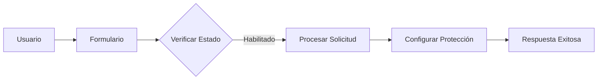
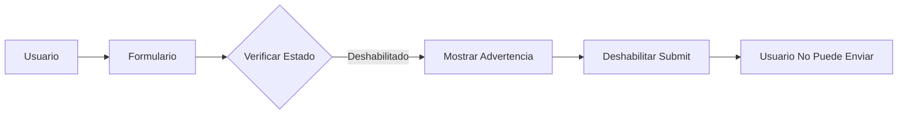
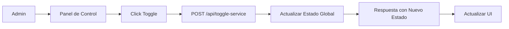

# 🔄 Implementación del Toggle de Servicio

## 📋 Resumen

Se ha implementado un sistema completo de activación/desactivación del servicio de protección perimetral, permitiendo al administrador controlar globalmente si el sistema procesa nuevas solicitudes.

## 🎯 Características Implementadas

### 1. Estado Global del Servicio

**Archivo:** `api/config.py`

```python
# Service State (Global)
SERVICE_ENABLED = True

def is_service_enabled():
    """Verifica si el servicio está habilitado"""
    return SERVICE_ENABLED

def toggle_service(state: bool):
    """Activa o desactiva el servicio globalmente"""
    global SERVICE_ENABLED
    SERVICE_ENABLED = state
    return SERVICE_ENABLED
```

**Características:**
- Estado global persistente en memoria
- Funciones simples y directas
- Retorna el nuevo estado después del cambio

### 2. Endpoint `/api/toggle-service`

**Archivo:** `api/toggle-service.py`

#### GET - Obtener Estado
```bash
curl http://localhost:3000/api/toggle-service
```

**Response:**
```json
{
  "status": "ok",
  "service_enabled": true,
  "message": "Servicio habilitado"
}
```

#### POST - Cambiar Estado
```bash
curl -X POST http://localhost:3000/api/toggle-service \
  -H "Content-Type: application/json" \
  -d '{"enabled": false}'
```

**Response:**
```json
{
  "status": "ok",
  "service_enabled": false,
  "message": "Servicio deshabilitado exitosamente",
  "previous_state": true
}
```

### 3. Verificación en Solicitudes

**Archivo:** `api/solicitar-proteccion.py`

El endpoint de solicitud de protección ahora verifica el estado del servicio:

```python
def do_POST(self):
    # Verificar si el servicio está habilitado
    if not is_service_enabled():
        self._send_json({
            "status": "error",
            "message": "El servicio está deshabilitado temporalmente",
            "service_disabled": True
        }, 503)
        return
    # ... resto del código
```

**Comportamiento:**
- Si el servicio está deshabilitado, retorna error 503
- Incluye flag `service_disabled: true` para identificación
- Mensaje claro para el usuario

### 4. Interfaz de Usuario

#### Panel de Control (`ControlPanelPage.tsx`)

**Características:**
- Toggle visual prominente con estado en tiempo real
- Indicador de color (verde = habilitado, rojo = deshabilitado)
- Botón para cambiar estado con confirmación visual
- Advertencia cuando el servicio está deshabilitado
- Carga automática del estado al montar el componente

**Elementos visuales:**
- Icono de Power con colores dinámicos
- Borde de color según estado
- Animaciones suaves con Framer Motion
- Mensaje de advertencia expandible

#### Formulario de Solicitud (`ServiceRequestForm.tsx`)

**Características:**
- Verificación automática del estado al abrir
- Banner de advertencia si el servicio está deshabilitado
- Botón de submit deshabilitado cuando el servicio no está activo
- Mensaje claro en el botón: "Servicio Deshabilitado"

## 🧪 Testing

**Archivo:** `scripts/test_toggle_service.py`

### Tests Implementados

1. **Test de Toggle Básico**
   - Deshabilitar servicio
   - Habilitar servicio
   - Toggle múltiple
   - Restaurar estado inicial

2. **Test de Persistencia**
   - Verificar que el estado se mantiene entre llamadas
   - Verificar consistencia después de cambios

3. **Test de Idempotencia**
   - Habilitar múltiples veces (debe ser idempotente)
   - Deshabilitar múltiples veces (debe ser idempotente)

### Ejecutar Tests

```bash
python scripts/test_toggle_service.py
```

**Resultado esperado:**
```
============================================================
🎉 TODOS LOS TESTS COMPLETADOS EXITOSAMENTE
============================================================
```

## 📊 Flujo de Operación

### Escenario 1: Servicio Habilitado (Normal)



### Escenario 2: Servicio Deshabilitado



### Escenario 3: Cambio de Estado



## 🔒 Consideraciones de Seguridad

### Estado en Memoria
- **Ventaja:** Rápido y simple
- **Limitación:** Se reinicia al reiniciar el servidor
- **Mejora futura:** Persistir en base de datos o Redis

### Control de Acceso
- **Actual:** Endpoint público (cualquiera puede cambiar el estado)
- **Recomendación:** Agregar autenticación/autorización
- **Mejora futura:** Implementar roles de administrador

### Auditoría
- **Actual:** Logs en consola
- **Recomendación:** Registrar cambios de estado en base de datos
- **Mejora futura:** Dashboard de auditoría

## 📈 Mejoras Futuras

### 1. Persistencia en Base de Datos

```python
# Ejemplo con Supabase
def toggle_service(state: bool):
    global SERVICE_ENABLED
    SERVICE_ENABLED = state
    
    # Persistir en DB
    supabase.table('service_config').upsert({
        'key': 'service_enabled',
        'value': state,
        'updated_at': datetime.now()
    }).execute()
    
    return SERVICE_ENABLED
```

### 2. Autenticación

```python
def do_POST(self):
    # Verificar token de admin
    auth_token = self.headers.get('Authorization')
    if not verify_admin_token(auth_token):
        self._send_json({
            "status": "error",
            "message": "No autorizado"
        }, 401)
        return
    # ... resto del código
```

### 3. Notificaciones

```python
def toggle_service(state: bool):
    global SERVICE_ENABLED
    old_state = SERVICE_ENABLED
    SERVICE_ENABLED = state
    
    # Notificar cambio
    if old_state != state:
        send_notification(
            f"Servicio {'habilitado' if state else 'deshabilitado'}"
        )
    
    return SERVICE_ENABLED
```

### 4. Programación de Mantenimiento

```python
# Deshabilitar automáticamente durante ventana de mantenimiento
def schedule_maintenance(start_time, end_time):
    schedule.every().day.at(start_time).do(lambda: toggle_service(False))
    schedule.every().day.at(end_time).do(lambda: toggle_service(True))
```

## 📝 Documentación Actualizada

- ✅ `docs/API_REFERENCE.md` - Endpoint documentado
- ✅ `scripts/test_toggle_service.py` - Tests completos
- ✅ `docs/TOGGLE_SERVICE_IMPLEMENTATION.md` - Este documento

## ✅ Checklist de Implementación

- [x] Estado global en `config.py`
- [x] Funciones `is_service_enabled()` y `toggle_service()`
- [x] Endpoint `/api/toggle-service` (GET y POST)
- [x] Verificación en `/api/solicitar-proteccion`
- [x] UI en Panel de Control
- [x] UI en Formulario de Solicitud
- [x] Tests unitarios
- [x] Documentación de API
- [x] Manejo de errores
- [x] Validación de parámetros
- [x] CORS configurado
- [x] Mensajes informativos

## 🎉 Conclusión

La implementación del toggle de servicio está completa y funcional. El sistema permite:

1. **Control Global:** Activar/desactivar el servicio desde un solo punto
2. **Feedback Visual:** UI clara que muestra el estado actual
3. **Prevención de Errores:** Formulario deshabilitado cuando el servicio no está activo
4. **Testing Completo:** Suite de tests que verifica todas las funcionalidades
5. **Documentación:** API y comportamiento completamente documentados

El sistema está listo para producción con las consideraciones de seguridad mencionadas para implementación futura.
